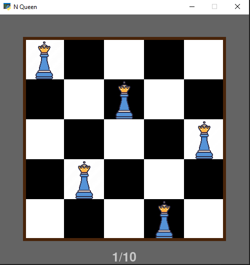

# Graphical Algorithmic Projects 🎮🧠

This repository contains several graphical implementations of classic algorithmic problems. All programs feature a GUI to make understanding and interacting with the algorithms more intuitive.

<br>
<div align="center" style="border: 2px dashed #ccc; border-radius: 10px; padding: 10px; width: fit-content; margin: auto;">
  
  <p>Main menu</p>
</div>

<br>

## 💡 Projects

1. **Hanoi Tower**  
   Graphical simulation of the Hanoi Tower problem with adjustable disk number.
<br><br>
<div align="center" style="border: 2px dashed #ccc; border-radius: 10px; padding: 10px; width: fit-content; margin: auto;">
  
  <p>6×6 magical square</p>
</div>
<br>

2. **N-Queens**  
   Graphical solver for the N-Queens problem with customizable board size.
<br>
<div align="center" style="border: 2px dashed #ccc; border-radius: 10px; padding: 10px; width: fit-content; margin: auto;">
  
  <p>N-Queens with N=5 (10 possible placements)</p>
</div>

<br>

3. **Sudoku**  
   Sudoku puzzle solver with a user-friendly graphical interface. User can enter the puzzle (sample is in board.txt).

<br>
<div align="center" style="border: 2px dashed #ccc; border-radius: 10px; padding: 10px; width: fit-content; margin: auto;">
  
</div>
<br>

<div align="center" style="border: 2px dashed #ccc; border-radius: 10px; padding: 10px; width: fit-content; margin: auto;">
  
</div>
<br>

4. **Magic Square**  
   Generator and visualizer for magic squares of different sizes(both even and odd sizes).

<br>

<div align="center" style="border: 2px dashed #ccc; border-radius: 10px; padding: 10px; width: fit-content; margin: auto;">
  
  <p>6×6 magical square</p>
</div>

<br>


## 🛠 Requirements

You'll need Python and GUI libraries  `tkinter` and `pygame` .

## 🚀 Run Instructions

To run each project:

```bash
python hanoi.py
python n_queens.py
python sudoku.py
python magic_square.py
```

Or all in one:
```bash
python main.py
```
