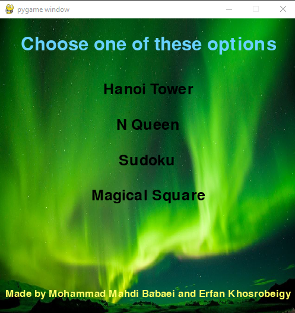
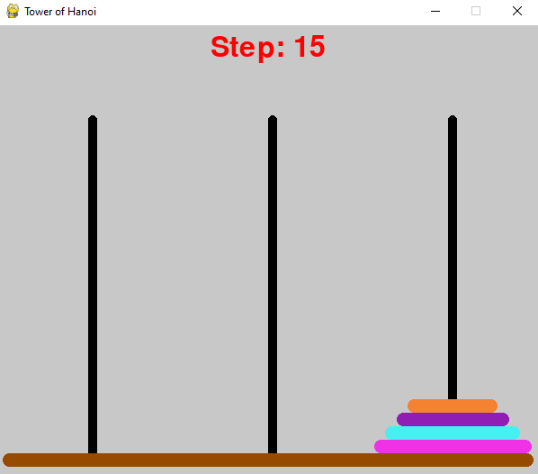
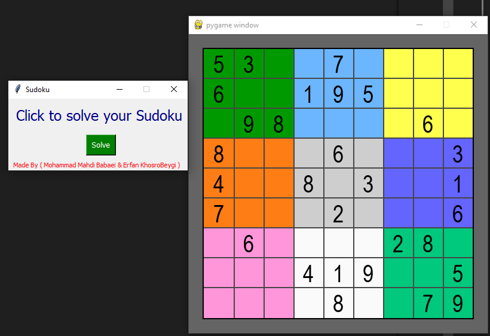
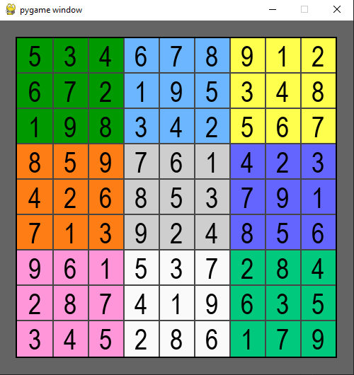
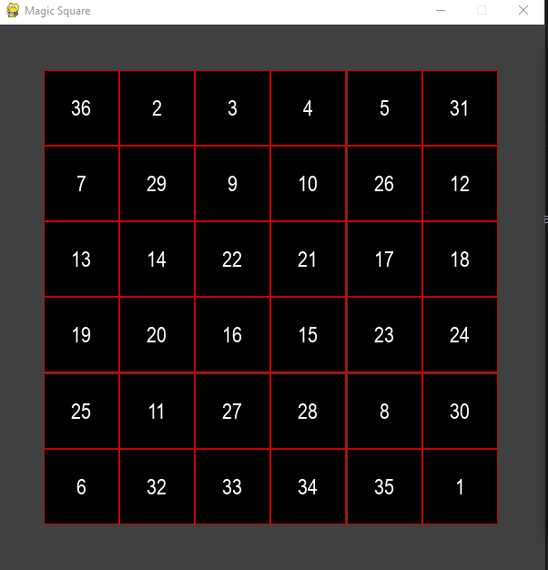

# Graphical Algorithmic Projects 🎮🧠

This repository contains several graphical implementations of classic algorithmic problems. All programs feature a GUI to make understanding and interacting with the algorithms more intuitive.



## 💡 Projects

1. **Hanoi Tower**  
   Graphical simulation of the Hanoi Tower problem with adjustable disk number.



2. **N-Queens**  
   Graphical solver for the N-Queens problem with customizable board size.


3. **Sudoku**  
   Sudoku puzzle solver with a user-friendly graphical interface. User can enter the puzzle (sample is in board.txt).




4. **Magic Square**  
   Generator and visualizer for magic squares of different sizes(both even and odd sizes).




## 🛠 Requirements

You'll need Python and GUI libraries  `tkinter` and `pygame` .

## 🚀 Run Instructions

To run each project:

```bash
python hanoi.py
python n_queens.py
python sudoku.py
python magic_square.py
```

Or all in one:
```bash
python main.py
```
